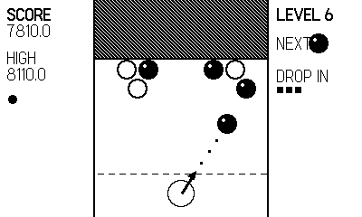

# Bauble

> Part of **[plAIdate](https://plaidate.github.io)** — AI-built 1-bit games, ports, and engines for the Playdate.

A 1-bit color-matching **bubble shooter** for the [Panic Playdate](https://play.date/):
crank to aim the launcher, fire bubbles up, and pop clusters of three or more
matching bubbles before the ceiling presses down on you. An original take on the
aim-and-pop bubble-puzzle genre, with fully procedural 1-bit art (the six bubble
types are told apart by **pattern**, not colour — no external assets).



See the **[player's manual](MANUAL.md)** for the full rules, scoring, and tips.

## Play it

Grab a prebuilt `Bauble.pdx.zip` from the [Releases](../../releases) page (or the
`dist/` folder), then sideload it at <https://play.date/account/sideload/> or unzip
it into the Playdate Simulator — no toolchain required. To build from source
instead, see [Build](#build) below.

## Controls

| Playdate | Action |
| --- | --- |
| crank (or d-pad) | aim the launcher |
| A / B | fire |

Dawdle too long and the launcher fires itself.

## Structure

Per-concern Lua modules under `source/` sharing global namespace tables:

| module | responsibility |
| --- | --- |
| `config` | tunables and flags |
| `util` | clamp + a delayed-call scheduler |
| `sfx` | synth sound effects |
| `bubbles` | the six 1-bit bubble sprites (patterns) |
| `gamestate` | mutable game state + helpers |
| `grid` | hex-cell math, matching, dropping, the ceiling compressor |
| `levels` | deterministic mirrored layouts per level |
| `shooter` | aiming, bubble flight, landing resolution |
| `input` | crank/d-pad controls |
| `draw` | rendering and menu screens |
| `main` | the game loop and state machine |

## Build

Requires the Playdate SDK (`pdc` on `PATH`).

```sh
make        # -> Bauble.pdx
make run    # build and open in the Playdate Simulator
make smoke  # instrumented autopilot build for headless testing
```

## License

MIT — see [LICENSE](LICENSE).
